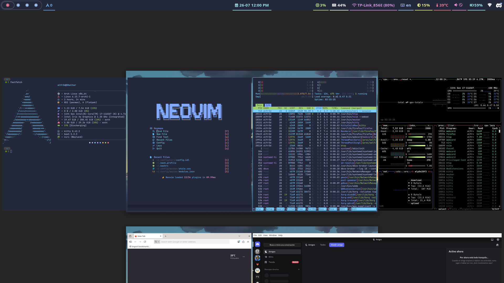

# ⭐ Dotfiles Niri ⭐

## These are elements of my configuration on Niri Compositor

# Niri



# Install the following packages

- niri
- waybar
- kitty
- fuzzel
- pipewire
- wireplumber
- pipewire-pulse
- sddm
- brightnessctl
- htop
- curl
- swww
- network-manager-applet
- hyprlock
- bat
- mako
- swayidle

# Install packages of AUR

- waypaper

# Tip

### Create ~/.config/systemd/user/swayidle.service. With the following contents:

```bash
    [Unit]
    PartOf=graphical-session.target
    After=graphical-session.target

    [Service]
    ExecStart=/usr/bin/swayidle -w timeout 300 'hyprlock' timeout 600 'swaymsg "output * power off"' resume 'swaymsg "output * power on"' before-sleep 'hyprlock'
    Restart=on-failure
```

### Then, run systemctl --user daemon-reload and add it to the niri session:

```bash
    systemctl --user add-wants niri.service swayidle.service
```
